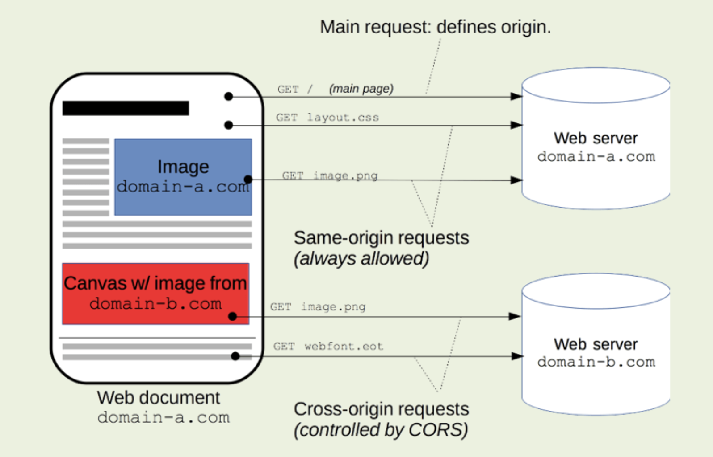

# Section 10 - AJAX and Simple GET

## Overview

AJAX is the cornerstone of modern web applications. The ability to asynchronously access data, perform calculations and 
dynamically update the DOM is a very important skill in the modern web developers tool box.

## Content Links

- AJAX - <https://www.w3schools.com/js/js_ajax_intro.asp>
  - XMLHttpRequest - <https://www.w3schools.com/js/js_ajax_http.asp>
  - AJAX Request - <https://www.w3schools.com/js/js_ajax_http_send.asp>
  - AJAX Response - <https://www.w3schools.com/js/js_ajax_http_response.asp>
- Cross-Origin Resource Sharing (CORS) - <https://developer.mozilla.org/en-US/docs/Web/HTTP/CORS>

## AJAX - Asynchronous JavaScript And XML

AJAX is not a programming language.

AJAX just uses a combination of:

- A browser built-in XMLHttpRequest object (to request data from a web server)
- JavaScript and HTML DOM (to display or use the data)

AJAX is a misleading name. AJAX applications might use XML to transport data, but it is equally common to transport data as plain text or JSON text.

AJAX allows web pages to be updated asynchronously by exchanging data with a web server behind the scenes. This means that it is possible to update parts of a web page, without reloading the whole page.

### How AJAX Works
    


- An event occurs in a web page (the page is loaded, a button is clicked)
- An XMLHttpRequest object is created by JavaScript
- The XMLHttpRequest object sends a request to a web server
- The server processes the request
- The server sends a response back to the web page
- The response is read by JavaScript
- Proper action (like page update) is performed by JavaScript
 
## The `XMLHttpRequest` Object

All modern browsers support the `XMLHttpRequest` object.

The `XMLHttpRequest` object can be used to exchange data with a web server behind the scenes. This means that it is possible to update parts of a web page, without reloading the whole page.

### Create an `XMLHttpRequest` Object

All modern browsers (Chrome, Firefox, IE, Edge, Safari, Opera) have a built-in `XMLHttpRequest` object.
            
```
const ajaxRequest = new XMLHttpRequest();
```

### Define the `onload` Callback Function

The `onload` event is fired when an XMLHttpRequest transaction completes successfully. 
Define a callback function to handle the response.
    
```
ajaxRequest.onload = function() {
  // Process the response when it is ready
}
```

### Define the URL and Send the Request with `open()` and `send()`

To send a request to a server, you use the `open()` and `send()` methods of the `XMLHttpRequest` object. The `open` 
method initializes the request and includes the http method (`GET` or `POST`) and the URL to call with any parameters. 
In a later section, the use of `POST` will be discussed. The `send()` method sends the request and the `onload` method
will be called when the request completes. 

```
ajaxRequest.open("GET", "ajax_info.php");
ajaxRequest.send();
```
             
This is a complete example of an AJAX call:

```
// Create an XMLHttpRequest object
const ajaxRequest = new XMLHttpRequest();

// Define a callback function
ajaxRequest.onload = function() {
  // Process the response when it is ready
}

// Send a request
ajaxRequest.open("GET", "ajax_info.php");
ajaxRequest.send();
```

### Access Across Domains and CORS (Cross-Origin Resource Sharing)
                    
Sometimes web applications need to recieve information from multiple domains. In the diagram
below resources (CSS files, images, fonts, and data) are collected from different web server domains. 



For security reasons, modern browsers do not allow access across domains by default. This means that both the web 
page (HTML) and the server files it uses (PHP), must be located on the same server.
 
There are two workarounds:
1. Upload the HTML and PHP files to your student account and test the HTML file (that uses the PHP file) via your student URL.
2. Add a CORS (Cross-Origin Resource Sharing) header to the PHP page. This will allow requests from different domains (ex. localhost) to be allowed. 

```
header('Access-Control-Allow-Origin: *');
header('Access-Control-Allow-Methods: GET');
header('Access-Control-Allow-Headers: Origin, Content-Type, Accept, Authorization, X-Request-With');
header('Content-Type: application/json');
```

## GET Requests

A simple GET request:
   
```
ajaxRequest.open("GET", "demo_get.asp");
ajaxRequest.send();
```

A GET request with parameters (information added to the URL):

```
ajaxRequest.open("GET", "demo_get2.asp?fname=Henry&lname=Ford");
ajaxRequest.send();
```

### Server Response
    
### The `responseText` Property

The `responseText` property returns the server response as a JavaScript string, and you can use it accordingly:

```
document.getElementById("demo").innerHTML = ajaxRequest.responseText;
```
     
This technique is useful when the response from the remote server is diplayed "as is" without modification.

